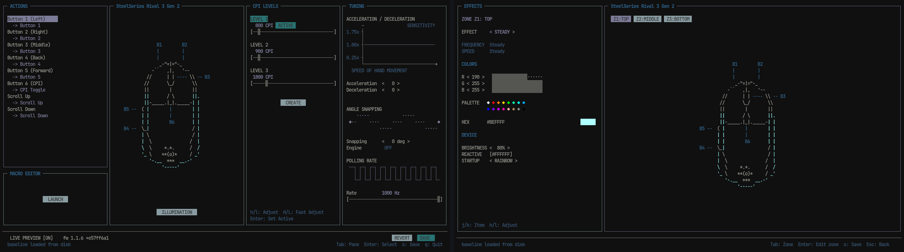

.. SPDX-License-Identifier: GPL-2.0-only

========
alloyctl
========

| Full-screen terminal replacement for SteelSeries Engine on Linux.
| Panes, modals, live preview, and every setting the hardware really has.
|

Supported hardware
==================

.. list-table::
   :header-rows: 1
   :widths: 45 25 30

   * - Device
     - Connectivity
     - Device ID
   * - SteelSeries Rival 3 (Gen 1)
     - USB (wired)
     - ``1038:1824``, ``1038:184c``
   * - SteelSeries Rival 3 Gen 2
     - USB (wired)
     - ``1038:1870``
   * - SteelSeries Aerox 3 Wireless
     - 2.4 GHz USB / Wired
     - ``1038:1838``
   * - SteelSeries Aerox 3 Wireless (BT)
     - Bluetooth LE
     - ``BUS_BLUETOOTH``

See the `documentation <https://alloy.szymon-wilczek.me/devices.html>`_ for full device notes.
Want yours supported? See `Adding a driver <https://alloy.szymon-wilczek.me/contributor/adding-a-driver.html>`_.

Features
========

* **Button remapping** -- every physical button and scroll direction mapped to mouse actions, CPI toggle, keyboard keys, or disabled.
* **Per-zone RGB** -- each LED zone addressed independently with live hardware preview, color steppers, preset palettes, and hex input.
* **Hardware lighting effects** -- native firmware rainbow cycling, reactive click illumination, and startup lighting mode.
* **CPI & Polling rate** -- interval sliders across the sensor's native range, active preset switching, and polling rate steppers.
* **Pointer tuning** -- host-side acceleration, deceleration, and angle snapping with visual curves.
* **Onboard persistence** -- instant live preview on hardware; **SAVE** commits to onboard flash memory, **REVERT** restores session baseline.

Quick start
===========

.. code-block:: sh

   make            # build alloyctl binary
   make test       # run unit test suite
   ./alloyctl      # launch TUI

Installation
============

Packages
--------

.. code-block:: sh

   # Fedora (COPR)
   sudo dnf copr enable szymon-wilczek/alloyctl
   sudo dnf install alloyctl

   # Arch Linux (AUR)
   yay -S alloyctl-bin

   # Debian / Ubuntu (.deb release)
   sudo apt install ./alloyctl_<version>_amd64.deb

   # Fedora / RHEL (.rpm release)
   sudo dnf install ./alloyctl-<version>.x86_64.rpm

   # NixOS (flake)
   # programs.alloyctl.enable = true; (via inputs.alloyctl.nixosModules.default)

From source
-----------

.. code-block:: sh

   sudo make install      # installs binary and udev rules
   sudo make uninstall

Documentation
=============

Online documentation and protocol references: https://alloy.szymon-wilczek.me

* `Supported devices <https://alloy.szymon-wilczek.me/devices.html>`_
* `Adding a driver <https://alloy.szymon-wilczek.me/contributor/adding-a-driver.html>`_
* `Contributing guidelines <https://alloy.szymon-wilczek.me/contributor/contributing.html>`_
* `Protocol documentation <https://alloy.szymon-wilczek.me/protocol/index.html>`_

Disclaimer
==========

alloyctl is an independent, unofficial project. It is not affiliated with, endorsed by, or sponsored by SteelSeries ApS. "SteelSeries" and "SteelSeries Engine" are trademarks of their respective owners, used here only to describe hardware compatibility.

License
=======

GPL-2.0-only. See `LICENSE <LICENSE>`_.
